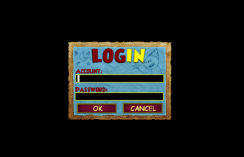
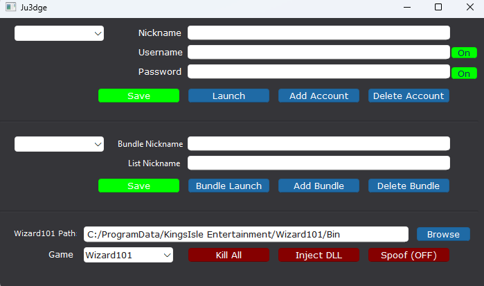
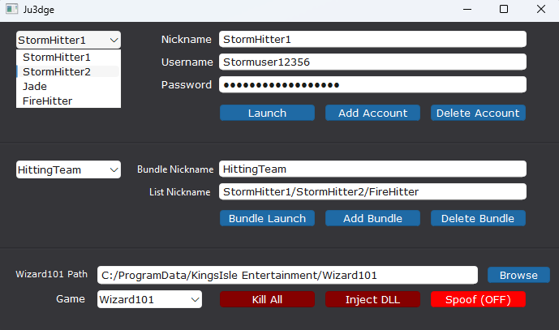

# KingsisleLauncher | Wizard101 and Pirate101

QT is a free and open-source widget toolkit for creating graphical user interfaces, will need to install to use:
https://doc.qt.io/qt-6/get-and-install-qt.html

## What is this Project

The Wizard101 launcher has both a file integrity checker and an update manager, requiring users to log in to each account sequentially. 
This ends up being very slow taking ~3 minutes per account login, this adds up quickly when trying to run multiple.

The game executable (WizardGraphicalClient.exe) is expected to be launched this way. 
This program, by directly launching `"C:\Wizard101\Bin\WizardGraphicalClient.exe" -L login.us.wizard101.com 12000` will skip everything. 
Its designed to only run when a trusted parent (like Wizard101GraphicalClient.exe) gives it a verified session token and the required launch flags.
Since the launcher doesn't do any OS-level validation — if you know the correct parameters and format, you can mimic the launcher yourself.

`-L` is a launch flag that tells the client to connect to a login server manually. 

`login.us.wizard101.com` The hostname of the Wizard101 US login server where the game authenticates your login

`12000` standard TCP port that Kingsisle uses for all their games

 

## Why it was Made

- This launcher was inspired by MilkLauncher, a Python-based tool created for launching Wizard101 & Pirate101. 
While MilkLauncher was a great tool, it didn't fully meet the needs of my group and a few others. 
We needed a solution that only launched the accounts I needed at any given time by setting a preset bundle. (eg hitters = 4 storm wizards, raid = 12 accounts, pvp = 2 accounts)

- Sometimes KingsIsle gives out "blacklisted account bans." For example, if you log into account and, a month later, KI blacklists that account, they may retroactively ban every HWID that accessed it within a certain time frame (timeframe is unknown). 
This means your own system could be blacklisted just for accessing a flagged account. 
To prevent KI from gathering your hwid of any accounts you have logged into (besides your main or any accounts you chose) a toggled spoofer will helps mask HWID and IP of any account you choose to hide.
***WORK IN PROGRESS***

- There will also be a built in DLL if you wish to add any QOL improvements after launch. ***WORK IN PROGRESS***

While these improvments are very niche and only targets a small audience, I needed these changes and I might as well make it open to the public.

## Top Section
This is used for single use login per account:

`Nickname` - A custom label you assign to each account. This helps you quickly identify which account is which inside the launcher

`Username` - In game username

`Password` - In game password

Launch button - used to launch the client that is currently selected in the top section dropdown
All account information is saved and read from files stored in the /information directory. These files are automatically loaded at startup

## Middle Section
This is used for people with many many accounts and need to sort to be sorted for certain situations. This sections allows user to store them in "Bundles" of your choosing, creating a multi launch preset.

`Bundle Launch`   - used to launch the client that is currently selected in the middle section dropdown

`Bundle Nickname` - used as a personal preference name to remind you of which accounts are inside the bundle

`Mass Nickname`   - This will use the nicknames from the top section to allow you to bundle accounts into 1 and launch at the same time seperated by `/`
	eg. "StormHitter/LifeJade/IceTank/FireHitter"

## Bottom Section
`KillAll`   - Instantly **hard** terminates all running clients meaning the game doesn't finish its logout logic and on next login, the client assumes you're still in your last loaded **state**

`InjectDLL` - Prompts the user to browse for a DLL file, which will then be automatically be injected into each launched client ***WORK IN PROGRESS***

`Spoof`     - When enabled, the launcher will spoof HWID and IP  ***WORK IN PROGRESS***

## How Launch Data is Sent
When you launch an account with the program:
1. The launcher constructs the appropriate launch command based on the selected game `-L login.us.wizard101.com 12000` or `-L login.us.pirate101.com 12000` 
2. It starts the game's executable using `CreateProcessW` from Win32 API
3. After a short delay to allow the game to start up, it finds the main window via `FindWindowW` for input
4. The launcher simulates keyboard input based on the users username and password

## Work in Progress
This project is a work in progress and will keep evolving over time (whenever I feel like it). Features are being added and changed on the fly, with only the client launcher working as of 04/05/2025

