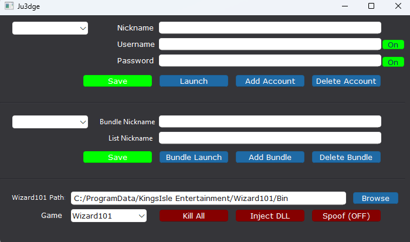

# KingsisleLauncher | Wizard101 and Pirate101

[Qt](https://doc.qt.io/qt-6/get-and-install-qt.html) is a free and open-source widget toolkit for creating graphical user interfaces as well as cross-platform applications that run on various software and hardware platforms with little or no change in the underlying codebase
https://doc.qt.io/qt-6/get-and-install-qt.html

## Work in Progress
This project is a work in progress and will keep evolving over time (whenever I feel like it). Features are being added and tweaked on the fly, with only the client launcher working

## Why it was made

This launcher was inspired by MilkLauncher, a Python-based tool created for launching Wizard101 & Pirate101. While MilkLauncher was a great tool, it didn�t fully meet the needs of my group�between me and a few others, we manage over 15 accounts each, and flexibility became essential.

I needed a solution that allowed precise control, launching only the accounts I needed at any given time. I don�t expect many people�if anyone�to use this, but it exists for those rare weirdos

## Top Section
This is used for single use logins:

Nickname      - A custom label you assign to each account. This helps you quickly identify which account is which inside the launcher

Username      - In game username

Password      - In game password

Launch button - used to launch the client that is currently selected in the top section dropdown
All account information is saved and read from files stored in the /information directory. These files are automatically loaded at startup

## Middle Section
This is used for people with many many accounts and need to sort them properly. This sections allows user to store them in "Bundles" of your choosing so you can login to these accounts whenever you need

Bundle Launch   - used to launch the client that is currently selected in the middle section dropdown
Bundle Nickname - used as a personal preference name to remind you of which accounts are inside the bundle
Mass Nickname   - This will use the nicknames from the top section to allow you to bundle accounts into 1 and launch at the same time
	eg. "StormHitter/LifeJade/IceTank/FireHitter"

## Bottom Section
KillAll   - Instantly hard terminates all running Wizard101 clients meaning relaunching will keep last interaction

InjectDLL - Prompts the user to browse for a DLL file, which will then be automatically be injected into each launched client WORK IN PROGRESS

Spoof     - When enabled, the launcher will spoof HWID and IP  WORK IN PROGRESS

# How autolaunch works
When you launch an account:
1. The launcher constructs the appropriate launch command based on the selected game.
2. It starts the game's executable using `CreateProcessW`.
3. After a short delay to allow the game to start up, it finds the window via `FindWindowW`.
4. The launcher simulates keyboard input to enter the username and password automatically.

UI Preview

